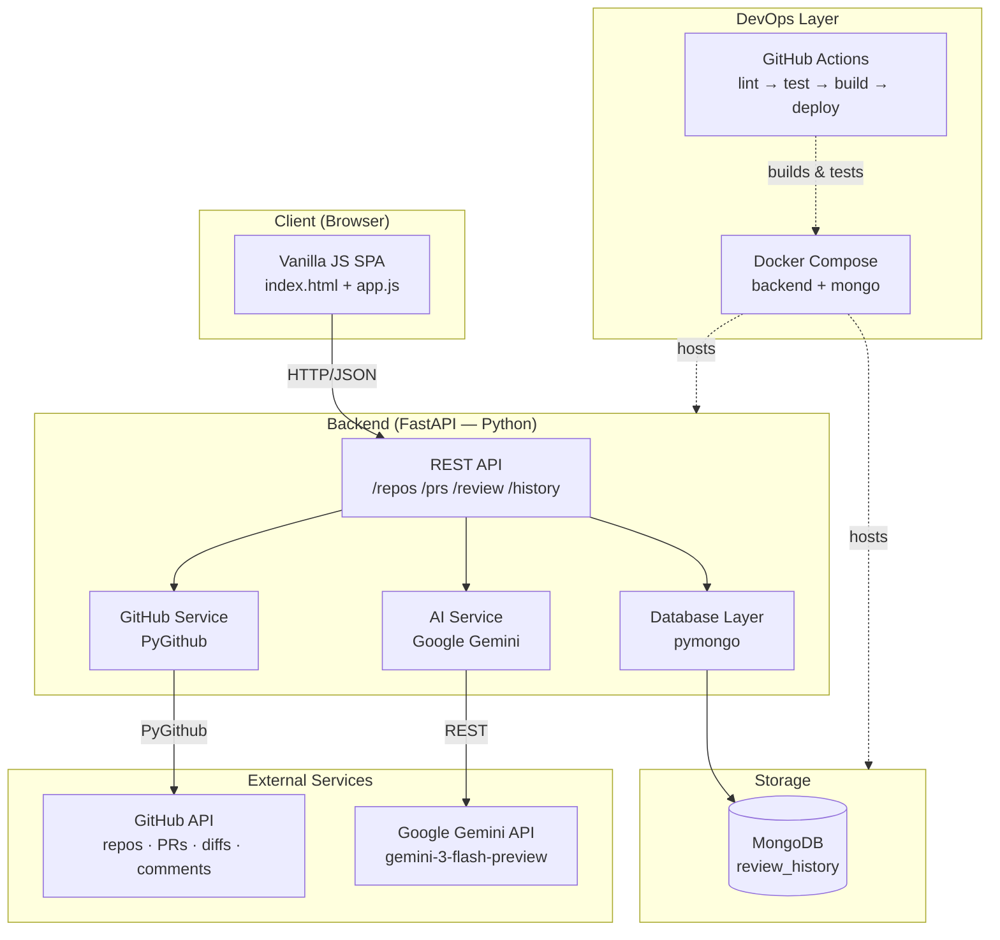
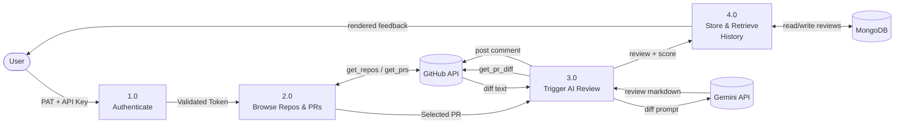
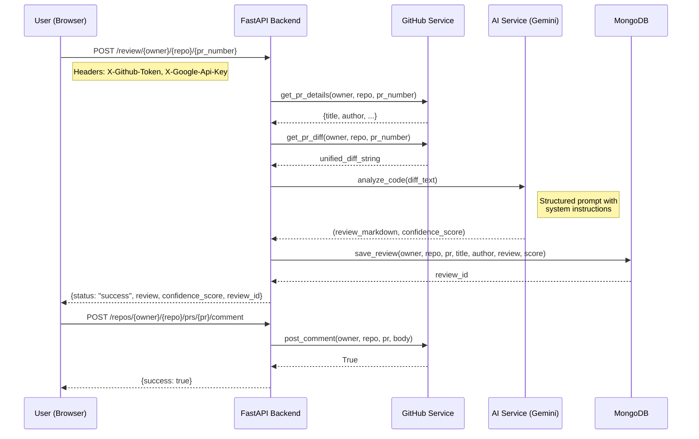
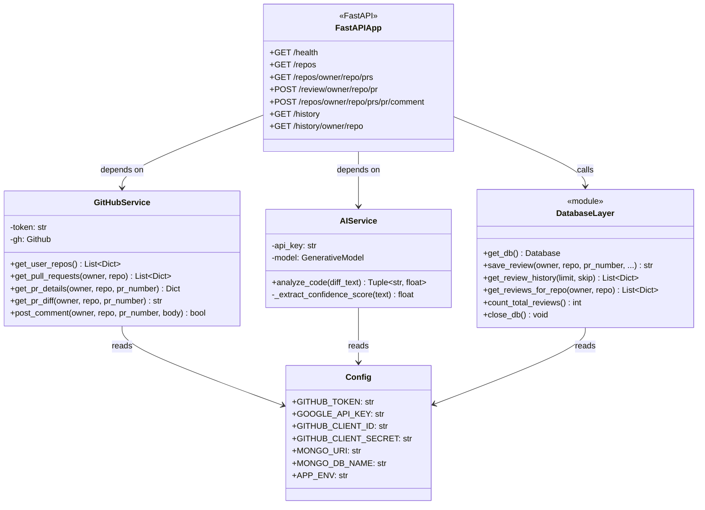

# System Architecture — AI Code Reviewer

## High-Level Architecture



---

## Component Layer Diagram

```
┌─────────────────────────────────────────────────────┐
│                  PRESENTATION LAYER                  │
│   Browser SPA (HTML + CSS + Vanilla JS)              │
│   ├── Auth Form (Token input)                        │
│   ├── Repository Browser + Search                    │
│   ├── Pull Request List (with stats)                 │
│   ├── AI Review Panel (Markdown rendered)            │
│   └── Review History (paginated)                     │
└──────────────────────┬──────────────────────────────┘
                       │ HTTP/JSON
┌──────────────────────▼──────────────────────────────┐
│                   API GATEWAY LAYER                  │
│   FastAPI Application (main.py)                      │
│   ├── CORS Middleware                                │
│   ├── Static File Server (frontend/)                 │
│   ├── Dependency Injection (tokens)                  │
│   └── Request/Response Validation (Pydantic)         │
└───────┬──────────────┬────────────────┬─────────────┘
        │              │                │
┌───────▼────┐  ┌──────▼──────┐ ┌──────▼──────────────┐
│  GitHub    │  │  AI Service  │ │  Database Layer      │
│  Service   │  │ (ai_service) │ │  (database.py)       │
│            │  │              │ │                      │
│ PyGithub   │  │ Gemini API   │ │ pymongo              │
│ OAuth/PAT  │  │ Prompt Eng.  │ │ CRUD Operations      │
│ REST calls │  │ Confidence   │ │ Index Management     │
└────────────┘  └─────────────┘ └──────────────────────┘
        │              │                │
┌───────▼────────────────────────────────▼─────────────┐
│              EXTERNAL DEPENDENCIES                    │
│  GitHub REST API v3    Google Gemini API  MongoDB 7   │
└──────────────────────────────────────────────────────┘
```

---

## Data Flow Diagram (DFD Level 1)



---

## Entity Relationship Diagram (MongoDB Schema)

```
┌────────────────────────────────────────────────────┐
│                  review_history                     │
├────────────────────────────────────────────────────┤
│  _id              ObjectId (auto)   PRIMARY KEY     │
│  owner            String            GitHub username │
│  repo             String            Repo name       │
│  pr_number        Integer           PR number       │
│  pr_title         String            PR title text   │
│  pr_author        String            GitHub username │
│  review_text      String            Markdown text   │
│  confidence_score Float             0.0 – 10.0      │
│  reviewed_at      DateTime (UTC)    Timestamp       │
├────────────────────────────────────────────────────┤
│  Indexes:                                           │
│    reviewed_at DESC  (sort by newest)               │
│    owner + repo      (repo-scoped queries)          │
│    pr_number         (PR lookup)                    │
└────────────────────────────────────────────────────┘
```

---

## Sequence Diagram — AI Review Flow



---

## Use Case Diagram

```
┌─────────────────────────────────────────────────────────┐
│                    AI Code Reviewer System               │
│                                                         │
│  ┌──────────┐                                           │
│  │          │──── Connect with GitHub Token ────────→  │
│  │          │──── Browse Repositories ─────────────→   │
│  │          │──── Select Repository ────────────────→  │
│  │ Developer│──── View Open Pull Requests ──────────→  │
│  │  (Actor) │──── Trigger AI Review ────────────────→  │
│  │          │──── View AI Feedback ──────────────────→ │
│  │          │──── Post Comment to GitHub ────────────→ │
│  │          │──── Browse Review History ─────────────→ │
│  └──────────┘                                           │
│                                                         │
│  ┌──────────┐                                           │
│  │          │──── Monitor Health Endpoint ───────────→ │
│  │  DevOps  │──── View API Documentation ────────────→ │
│  │  (Actor) │──── Run Docker Compose ────────────────→ │
│  └──────────┘                                           │
└─────────────────────────────────────────────────────────┘
```

---

## Class Diagram


