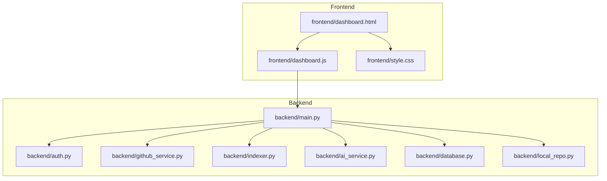

# Frontend Dashboard Architecture and Page Documentation

This document explains the dashboard frontend architecture, data flow, and documentation for each page.

## 1. Frontend Runtime Architecture

```mermaid
flowchart LR
    U[User Browser] --> D[dashboard.html]
    D --> J[dashboard.js]
    D --> S[style.css]
    J --> A1[/auth/status]
    J --> A2[/auth/me]
    J --> R1[/repos]
    J --> R2[/repos/{owner}/{repo}/prs]
    J --> RV[/review/{owner}/{repo}/{pr_number}]
    J --> C1[/repos/{owner}/{repo}/prs/{pr_number}/comment]
    J --> H1[/history]
    J --> H2[/history/review/{id}]
    RV --> G[GitHubService]
    RV --> I[Indexer]
    RV --> AI[AIService]
    RV --> DB[(SQLAlchemy DB)]
```

## 2. Frontend Code Module Map



## 3. Dashboard Page Documentation

### Overview
- Purpose: Show platform status and readiness.
- Inputs: Session status, repos, PRs, history, and health.
- Outputs: KPI cards, pipeline timeline, language distribution bars.
- Main handlers: `loadHealth`, `renderOverview`, `renderLanguageMix`.

### Repositories
- Purpose: List repositories and allow repository selection.
- Inputs: `/repos` response.
- Outputs: Repository table and repository selector options.
- Main handlers: `loadRepositories`, `renderRepoTable`.

### Pull Requests
- Purpose: Show open PRs for selected repository.
- Inputs: `/repos/{owner}/{repo}/prs` response.
- Outputs: PR table and PR selector options.
- Main handlers: `loadPullRequests`, `renderPrTable`.

### Analysis Studio
- Purpose: Trigger deep analysis pipeline and show progress.
- Inputs: Selected repo and PR.
- Outputs: Progress bars, current review state.
- Main handlers: `runAnalysis`, `setPipeline`.

### Deep Report
- Purpose: Render multi-page AI report and page-level documentation.
- Inputs: `review` payload with `report_pages`, `page_documentation`, `issue_counts`.
- Outputs: Report navigation, report body, page docs, top findings, executive snapshot.
- Main handlers: `renderReportNavigation`, `openReportPage`, `renderPageDocumentation`, `renderFindingsAndMetrics`.

### History
- Purpose: Load and restore past review records.
- Inputs: `/history` and `/history/review/{id}`.
- Outputs: Historical rows and restored report context.
- Main handlers: `loadHistory`, `openHistory`, `renderHistoryTable`.

### Docs and Architecture
- Purpose: Present frontend system architecture and developer documentation.
- Inputs: Static Mermaid diagrams and runtime selection context.
- Outputs: Architecture graphs, page docs catalog, endpoint mapping timeline.
- Main handlers: `renderDocsArchitecture`, `renderDocsCatalog`, `renderEndpointDocs`, `renderMermaid`.

### Settings
- Purpose: Configure session runtime options.
- Inputs: Gemini API key and session endpoints.
- Outputs: Saved key state and UX feedback.
- Main handlers: Save key and show/hide handlers in `wireEvents`.

## 4. Deep Report Page Documentation Contract

Expected response object from review endpoint:

- `report_pages`: Keyed sections used for page navigation.
- `page_documentation`: Per-page documentation map with:
  - `title`
  - `what_is_happening`
  - `what_is_wrong`
  - `why_it_matters`
  - `recommended_actions`
  - `cross_links`
- `issue_counts`: Severity counters (critical/high/medium/low).
- `top_findings`: Headline findings list.

## 5. Maintenance Notes

- If a new dashboard page is added, update:
  - Sidebar navigation in `frontend/dashboard.html`.
  - Title mapping and documentation catalog in `frontend/dashboard.js`.
  - Styling blocks in `frontend/style.css`.
- If a new API endpoint is added for dashboard usage, extend `renderEndpointDocs` and this document.
